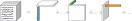

# SliceTCA

This library provides the tools to perform [SliceTCA]().

___

<p align="center">
  
</p>

## Installation 

```commandline
pip install slicetca
```


## Examples

### Quick example 

```python
import torch
from slicetca import *

device = ('cuda' if torch.cuda.is_available() else 'cpu')

#your_data is a numpy array of shape (trials,neuron,time).
data = torch.tensor(your_data, device=device)

#The tensor is decomposed into 2 trial-, 0 neuron- and 3 time-slicing components.
components, _ = decompose(data, (2,0,3))
```

### Notebook

See the [example notebook]() for an application of the method to publicly available data.

### Full documentation

The full documentation can be found [here]().

## Reference

A. Pellegrino<sub>@</sub><sup>†</sup>, H. Stein<sup>†</sup>, N. A. Cayco-Gaijc<sub>@</sub>, 2023, Disentangling Mixed Classes of Covariability in Large-Scale Neural Data. Biorxiv:.